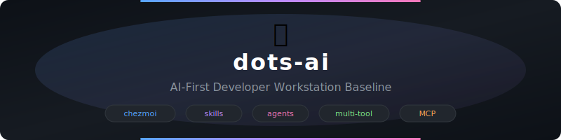

<div align="center">

<picture>
  <source media="(prefers-color-scheme: dark)" srcset="static/hero-banner.svg">
  <source media="(prefers-color-scheme: light)" srcset="static/hero-banner.svg">
  
</picture>

<br>

[](LICENSE)
[](https://www.chezmoi.io/)
[](https://github.com/ulises-jeremias)

<br>

[](https://github.com/ulises-jeremias/dots-ai/actions/workflows/validate-workstation.yml)
[](https://github.com/ulises-jeremias/dots-ai/actions/workflows/devcontainer-chezmoi-validate.yml)
[](https://github.com/ulises-jeremias/dots-ai/actions/workflows/pre-commit.yml)
[](https://github.com/ulises-jeremias/dots-ai/actions/workflows/megalinter-v9.yml)
[](https://github.com/ulises-jeremias/dots-ai/actions/workflows/security-scan.yml)
[](https://github.com/ulises-jeremias/dots-ai/actions/workflows/release-ai-assets.yml)

<br>


<br>

[Documentation](https://github.com/ulises-jeremias/dots-ai/wiki) · [Quick Start](#-quick-start) · [Contributing](CONTRIBUTING.md) · [Docs Index](docs/)

</div>

---

Standardizes AI developer tooling for developers across **Linux**, **macOS**, and **Windows** — with profile-based installation, AI tooling, shared skills and agents for AI coding tools, MCP templates, and a dev companion runner.

## Related Projects

`dots-ai` provides the workstation layer: chezmoi-managed tools, skills, agents,
MCP templates, and CLI helpers. Pair it with
[`ai-workspace`](https://github.com/ulises-jeremias/ai-workspace) for a portable
workspace harness with persistent memory, indexed repositories, personas, packs,
and background job orchestration.

<details>
<summary><b>Table of Contents</b></summary>

- [Quick Start](#-quick-start)
- [What You Get](#-what-you-get)
- [Post-Setup Validation](#-post-setup-validation)
- [AI Skills](#-ai-skills)
- [AI Agents](#-ai-agents)
- [CLI Helpers](#-cli-helpers)
- [MCP Templates](#-mcp-templates)
- [Documentation](#-documentation)
- [Supported Platforms](#-supported-platforms)
- [Security](#-security)
- [Need Help?](#-need-help)

</details>

---

## Quick Start

### Linux / macOS (5 minutes)

```bash
# One-liner install
bash <(curl -fsSL https://raw.githubusercontent.com/ulises-jeremias/dots-ai/main/install.sh)

# Or manually:
git clone git@github.com:ulises-jeremias/dots-ai.git
cd dots-ai
chezmoi init --source=. -c ~/.config/chezmoi/dots-ai.toml
chezmoi apply --source=. -c ~/.config/chezmoi/dots-ai.toml --dry-run   # preview
chezmoi apply --source=. -c ~/.config/chezmoi/dots-ai.toml             # apply

# Validate
dots-doctor
```

> [!TIP]
> The init questionnaire starts by asking for a **profile** (`technical`, `ai`, `python`, `data`, `minimal`, `custom`, etc.). See [docs/INIT_QUESTIONNAIRE.md](docs/INIT_QUESTIONNAIRE.md) for every prompt and shortcut, and [docs/PROFILES.md](docs/PROFILES.md) for the profile → feature-group matrix. Opting out of any feature is safe by construction: every install block is template-gated so disabling a group elides its script entirely.

### Windows — WSL2 (Recommended)

```powershell
# In PowerShell (auto-detects WSL2)
irm https://raw.githubusercontent.com/ulises-jeremias/dots-ai/main/install.ps1 | iex
```

> [!TIP]
> See [docs/WINDOWS.md](docs/WINDOWS.md) for full Windows setup including Git Bash and skills-only options.

### Skills Only (no full install)

For anyone who just wants the AI skills and agents without the full toolchain:

```bash
# Linux / macOS / WSL2
curl -fsSL https://github.com/ulises-jeremias/dots-ai/releases/latest/download/install-skills.sh | sh
```

```powershell
# Windows (PowerShell)
irm https://github.com/ulises-jeremias/dots-ai/releases/latest/download/install-skills.ps1 | iex
```

> [!TIP]
> Not a developer? Follow the copy-paste walkthrough in [docs/GUIDED_AI_INSTALL.md](docs/GUIDED_AI_INSTALL.md) — it covers prerequisites, per-tool install, verification, and common errors for non-technical users.

> [!IMPORTANT]
> After `chezmoi apply`, open a **new terminal** and run `dots-doctor` to validate the installation.

---

## What You Get


---

## Post-Setup Validation

After `chezmoi apply`, open a **new terminal** and run:

```bash
dots-doctor
```

<details>
<summary><b>Expected output (success)</b></summary>

```
[dots-doctor] starting dots-ai workstation health checks
[dots-doctor] checking command: git
  [OK] git available (git version 2.43.0)
[dots-doctor] checking command: curl
  [OK] curl available (curl 8.6.0)
[dots-doctor] checking directory: /home/user/.local/share/dots-ai/prompts
  [OK] directory present: /home/user/.local/share/dots-ai/prompts
[dots-doctor] checking directory: /home/user/.local/share/dots-ai/skills
  [OK] directory present: /home/user/.local/share/dots-ai/skills
[dots-doctor] checks completed: 15/15 passed
[dots-doctor] result: COMPLIANT
Workstation looks compliant with dots-ai baseline.
```

</details>

> [!WARNING]
> If `dots-doctor` reports failures, fix missing tools manually or re-run `chezmoi apply` after updating your choices. See [docs/TECHNICAL_QUICKSTART.md](docs/TECHNICAL_QUICKSTART.md) for troubleshooting.

---

## AI Skills

Skills are markdown documents that teach AI tools how to perform specific workflows. They live in `~/.local/share/dots-ai/skills/` and are symlinked to each AI tool's config directory by `dots-skills sync`.

|-------|---------|

### External Skills (opt-in)

|-------|---------|

> [!NOTE]
> See [docs/SKILLS.md](docs/SKILLS.md) for the full skills system — manifests, registry, compatibility matrix, and publishing guide.

---

## AI Agents

15 specialized subagents installed to `~/.claude/agents/`, `~/.config/opencode/agents/`, Cursor rules, and Windsurf rules:

|-------|---------|

**Supported tools:**
- **OpenCode**: `@agent-name` — works immediately after `chezmoi apply`
- **Claude Code**: `@agent-name` — works immediately after `chezmoi apply`
- **Cursor**: Agent rules auto-load based on context
- **Windsurf**: Global rules applied across all workspaces

> [!TIP]
> No configuration needed — agents are installed to tool-specific directories automatically via chezmoi.

---

## CLI Helpers

|---------|-------------|

> [!TIP]
> See [docs/CLI_HELPERS.md](docs/CLI_HELPERS.md) for detailed subcommand reference.

---

## MCP Templates

Ready-to-use Model Context Protocol server templates in `~/.local/share/dots-ai/mcp/`:

- `github/` — GitHub MCP server
- `clickup/` — ClickUp MCP server
- `slack/` — Slack MCP server

See [docs/MCP_TEMPLATES.md](docs/MCP_TEMPLATES.md) for configuration instructions.

---

## Optional: Enable Jira Assistant

If you work with Jira, enable the JIRA Assistant:

```bash
# Copy the example and fill in your credentials
cp ~/.config/dots-ai/env.d/jira.env.example ~/.config/dots-ai/env.d/jira.env
$EDITOR ~/.config/dots-ai/env.d/jira.env

# Re-apply to install the skill
chezmoi apply --source=. -c ~/.config/chezmoi/dots-ai.toml
```

> [!TIP]
> The same Atlassian API token works for both JIRA and Confluence.
> See [docs/CREDENTIALS_SETUP.md](docs/CREDENTIALS_SETUP.md) for the full step-by-step guide including GitHub CLI and ClickUp authentication.

---

## Documentation

For deeper documentation, see the [`docs/`](docs/) directory:

|----------|-------|

Architecture Decision Records: [`docs/adrs/`](docs/adrs/)

---

## Directory Structure

```
.
├── home/                    # chezmoi source state (applied to your machine)
│   ├── .chezmoidata/        # Configuration data (profiles, packages, skills)
│   ├── .chezmoiscripts/     # Installation scripts
│   ├── dot_local/           # Files deployed to ~/.local/
│   │   ├── bin/             # dots-* CLI helpers
│   │   └── share/dots-ai/   # Shared AI resources
│   └── dot_config/          # Files deployed to ~/.config/
├── docs/                    # Documentation
│   ├── adrs/                # Architecture Decision Records
│   ├── wiki/                # Wiki-synced content
│   ├── ARCHITECTURE.md      # System design
│   ├── AI_LAYER.md          # AI tooling guide
│   ├── DEV_COMPANION.md     # Dev companion overview
│   └── *.md                 # Additional docs
├── lib/                     # Shared libraries and schemas
├── scripts/                 # Validation and CI scripts
└── .github/                 # CI/CD workflows
```

---

## Supported Platforms

|----------|---------|-----|

> [!TIP]
> See [docs/WINDOWS.md](docs/WINDOWS.md) for Windows-specific setup instructions.

---

## Keeping Your Setup Updated

```bash
# Check for updates
dots-update-check

# Apply latest changes
chezmoi update

# Re-validate
dots-doctor
```

---

## Security

- No credentials are committed
- Secrets via environment variables only
- `dots-doctor` provides baseline compliance visibility
- MCP templates require explicit local configuration

> [!CAUTION]
> Never commit API tokens, passwords, or private keys. Use `~/.config/dots-ai/env.d/` for local secrets. See [SECURITY.md](SECURITY.md) for reporting vulnerabilities.

---

## Need Help?

1. Check the [docs/](docs/) directory for detailed guides
2. Run `dots-doctor` to validate your setup
3. Ask in the #tech-support channel
4. Open an issue in this repository

---

<div align="center">

<a href="https://github.com/ulises-jeremias/dots-ai/graphs/contributors">
  
</a>

</div>
