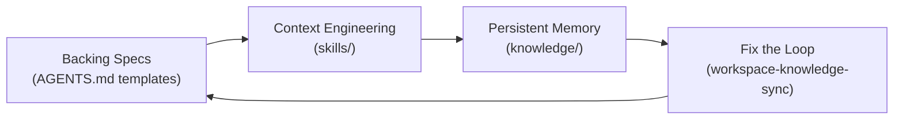
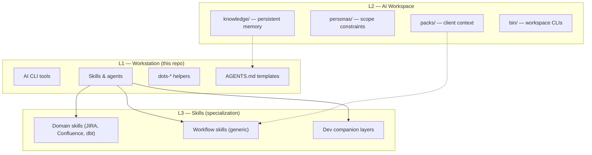
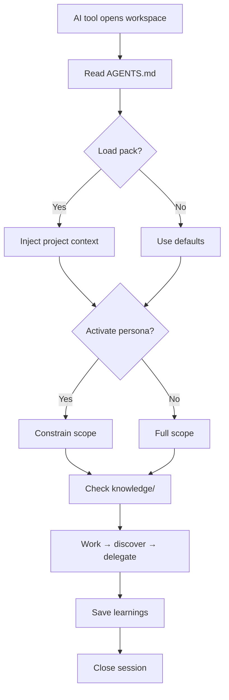

# Agentic Harness Framework

> The conceptual and operational framework behind dots-ai AI tooling.

---

## What is an Agentic Harness?

An **agentic harness** is the infrastructure layer that amplifies an AI tool. It provides:

- **Persistent memory** — knowledge that survives across sessions
- **Context engineering** — exactly the right information at the right time
- **Workflow orchestration** — routing tasks to the right skills and subagents
- **Specs and conventions** — telling the AI *how* to work, not just *what* to do

The harness doesn't replace your AI tool — it makes it dramatically more effective by solving the stateless session problem.

---

## The Ralph Loop

The harness implements the **Ralph Loop** — a four-phase feedback cycle described by [Geoffrey Huntley](https://ghuntley.com/loop/):

```text
┌─────────────────────────────────────────────────────────┐
│                      Ralph Loop                          │
│                                                          │
│  Backing Specs  →  Context Engineering                   │
│       ↑                   ↓                              │
│  Fix the Loop  ←  Persistent Memory                      │
└─────────────────────────────────────────────────────────┘
```

### How dots-ai implements it



| Ralph Concept | dots-ai Implementation |
|---------------|------------------------|
| **Backing specifications** | `AGENTS.md` templates in `home/.chezmoitemplates/agents/` |
| **Context engineering** | `~/.local/share/dots-ai/skills/` — modular skill packs |
| **Persistent memory** | `dots-ai-workspace/knowledge/` — session discoveries |
| **Fix the loop** | `dots-ai-workspace-knowledge-sync` skill — auto-syncs |

---

## The Three Layers



The dots-ai harness has three distinct layers:

### Layer 1 — Workstation (this repo)

The **infrastructure layer**:

- Installs AI CLI tools (opencode, Claude Code, Copilot CLI, pi agent, and optionally Cursor)
- Deploys skills to the right directories for each tool
- Provides `dots-*` helper commands
- Manages `AGENTS.md` templates for repos

→ See `docs/AI_LAYER.md` for the full AI layer reference.

> [!NOTE]
> This layer is what `dots-ai` provides. Layers 2 and 3 are operational concerns of the running workspace.

### Layer 2 — AI Workspace

The **running instance layer**:

- Persists knowledge across sessions (`knowledge/`)
- Manages project context (repos, packs, personas)
- Provides `bin/` CLIs: `assistant-memory`, `devcompanion`, `workspace-context`
- Is the context the orchestrator AI session runs inside

→ See [dots-ai-workspace](https://github.com/ulises-jeremias/dots-ai-workspace) for the running instance.

### Layer 3 — Skills

The **specialization layer**:

- Domain-specific instructions for tasks (JIRA, Confluence, dbt, etc.)
- Delivery workflow skills (generic) + workspace overlays
- Agent templates for new repos

→ See `docs/SKILLS.md` for the full skills reference.

---

## Session Lifecycle



A typical AI session with the harness:

```text
1. AI tool opens workspace directory
2. Reads AGENTS.md → understands context, routing, rules
3. (Optional) load pack → injects project-specific context
4. (Optional) activate persona → constrains scope
5. Check knowledge/ → what did we learn before?
6. Work → discover → delegate to skills/subagents
7. Save → assistant-memory add --type learning "..."
8. Close session → discoveries persist in knowledge/
```

The harness ensures step 5 ("what did we learn before?") always has useful answers.

> [!TIP]
> Use `assistant-memory search "topic"` to check if prior sessions discovered relevant patterns before asking the user.

---

## Portability

The harness is designed to work with multiple AI tools:

| AI Tool | Entry point |
|---------|-------------|
| Claude Code | `AGENTS.md` |
| opencode | `AGENTS.md` |
| Cursor | `CLAUDE.md` → symlink |
| Gemini CLI | `AGENTS.md` (no dedicated symlink yet; planned) |
| GitHub Copilot | `.github/copilot-instructions.md` → symlink |

The workstation (`dots-skills sync`) manages the per-tool skill directories. The workspace manages the per-session context files.

---

## Generic Harness Starter

The `dots-ai-workspace` serves dual purposes:

1. **dots-ai running instance** — with team-specific processes, client packs, and accumulated knowledge
2. **Generic starter** — the `main` branch contains a fully generic, team-agnostic version that anyone can clone and use

If you're setting up a new AI workspace (personal or for a new client team), start from the repo:

```bash
git clone git@github.com:dots-ai/dots-ai-workspace.git ~/.ai-workspace
cd ~/.ai-workspace
rm -rf .git && git init
./scripts/workspace-init.sh
```

---

## Key Design Decisions

### Orchestrator, not expert

The workspace orchestrator session is a **router**, not an expert. It:
1. Determines task type
2. Delegates to the right skill or subagent
3. Reports results
4. Saves knowledge

Specialists (code-reviewer, security-reviewer, tdd-guide) do the deep work.

### Personas constrain scope

Personas define what the AI **does**, not who it is. `reviewer` means "analyze and report, no changes" — not "you are a senior engineer". Constraint-first framing prevents scope creep.

### Packs manage context switching

When working across multiple clients, packs bundle the context (repos, IDs, conventions) needed to switch contexts without re-teaching the AI. Load a pack, get full context.

### Knowledge compounds

Every correction, every discovered pattern, every learned ID gets saved to `knowledge/`. The workspace gets more effective over time because the loop improves itself.

---

## References

- [The Ralph Loop](https://ghuntley.com/loop/) — Geoffrey Huntley's original concept
- [AI_LAYER.md](AI_LAYER.md) — skills system and Ralph Loop mapping
- [MULTI_AGENT_ORCHESTRATION.md](MULTI_AGENT_ORCHESTRATION.md) — multi-agent topology
- [ECC_PATTERNS.md](ECC_PATTERNS.md) — loop guardrails and quality gates
- [DEV_COMPANION_PLATFORM.md](DEV_COMPANION_PLATFORM.md) — pack schema and multi-harness design
- [dots-ai-workspace](https://github.com/ulises-jeremias/dots-ai-workspace) — the running instance
