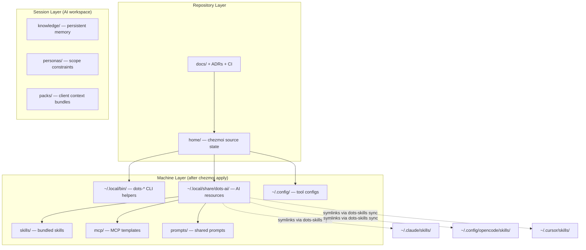

# Architecture

> Layered design model and source state conventions for the dots-ai workstation.

---

`dots-ai` keeps repository governance and workstation state clearly separated.

## Design principles

- Keep the source state simple and predictable.
- Prefer profile-driven behavior over host-specific custom logic.
- Keep scripts idempotent and safe to re-run.
- Treat docs, wiki, and ADRs as first-class product artifacts.

---

## Layered model

### Layer details

1. **Data model** (`home/.chezmoidata`)
   Shared configuration for package groups, AI settings, profiles, and the skills registry index.
2. **Bootstrap scripts** (`home/.chezmoiscripts`)
   Idempotent setup scripts executed by `chezmoi`. Includes skills sync via `dots-skills sync`.
3. **Templates** (`home/.chezmoitemplates`)
   Reusable AI instruction templates for projects and assistants.
4. **Shared assets** (`home/private_dot_local/share/dots-ai`)
   Prompts, skills, templates, MCP provider examples, and the runtime skills registry.
5. **CLI helpers** (`home/private_dot_local/bin`)
   Internal operations commands with `dots-` prefix, including `dots-skills`.

---

## Skills architecture

Skills are the primary AI-facing assets. They follow a two-layer model:

- **Bundled skills** — defined in this repo, distributed via chezmoi to `~/.local/share/dots-ai/skills/`.
- **External skills** — installed from npm, GitHub, or URLs by `dots-skills install`, placed in `~/.local/share/dots-ai/skills-external/`.

Each skill contains a `skill.json` manifest that declares compatibility with each AI tool. `dots-skills sync` reads those manifests and creates symlinks in tool-specific directories (e.g. `~/.claude/skills/`, `~/.copilot/skills/`).

> [!NOTE]
> See [SKILLS.md](SKILLS.md) for the full skills system documentation including how to add bundled or external skills.

---

## Source state convention

- `.chezmoiroot` points to `home`.
- The repository root stays dedicated to docs, CI, project metadata, and shared schemas.
- `lib/schemas/` contains JSON Schema definitions (e.g. `skill.schema.json`).

> [!IMPORTANT]
> Never place chezmoi-managed files at the repository root. All source state lives under `home/`.

---

## See Also

- [SKILLS.md](SKILLS.md) — full skills system documentation
- [AI_LAYER.md](AI_LAYER.md) — AI directory structure and Ralph Loop model
- [AGENTIC_HARNESS.md](AGENTIC_HARNESS.md) — three-layer architecture framework
- [wiki/PROFILES.md](wiki/PROFILES.md) — profile selection and feature groups
- [adrs/](adrs/) — architecture decision records
