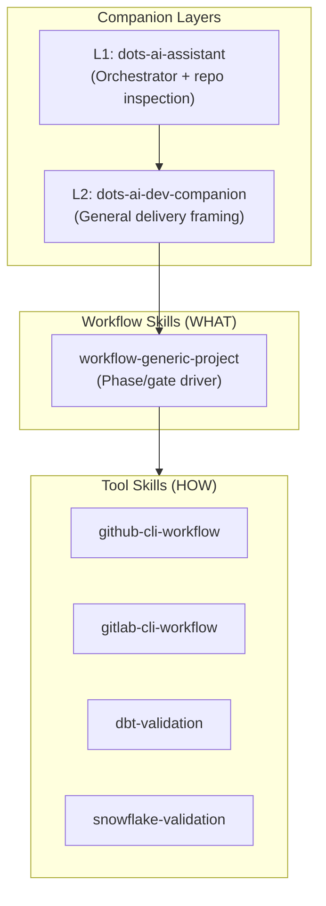
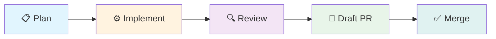

# dots-ai Dev Companion (general)

This document is a **human** overview. Authoritative agent instructions live under **`~/.local/share/dots-ai/skills/`** after `chezmoi apply` (see **`dots-ai-dev-companion`**, **`skill-catalog.yaml`**, **`dots-ai-assistant/references/ORCHESTRATION.md`**).

## Companion layer model



## Layers

| Layer | Bundled skill | Purpose |
| --- | --- | --- |
| L1 | **dots-ai-assistant** | Orchestrator + repo inspection order (every repo) |
| L2 | **dots-ai-dev-companion** | General dev companion framing for client work |

Workflow skills (**workflow-generic-project**) remain the **phase/gate** drivers; **HOW** (CLI) stays in tool skills.

> [!NOTE]
> The L1 orchestrator (`dots-ai-assistant`) is loaded in **every** repo. L2 (`dots-ai-dev-companion`) is opt-in for client delivery work and adds phased delivery framing on top.

## Delivery flow



## Cursor rules pattern (client repos)

Use **thin** project rules that **point** to repo contracts instead of duplicating skills:

1. **Always**: `AGENTS.md` is the primary contract for that repository.
2. **Always**: follow **`dots-ai-assistant`** discovery order when doing substantive work.
3. **Default client delivery**: cite **`dots-ai-dev-companion`** + **`workflow-generic-project`** for phased delivery.

Example stub for `.cursor/rules/dots-ai-dev-companion.mdc` (adjust globs):

```markdown
---
description: dots-ai companion routing for this repo
globs:
  - "**/*"
---

- Follow root `AGENTS.md` first.
- Use bundled skills under `~/.local/share/dots-ai/skills/`; orchestrate via `dots-ai-assistant` and `skill-catalog.yaml`.
- For generic client delivery: `dots-ai-dev-companion` + `workflow-generic-project`.
```

> [!TIP]
> Keep rules **short**; put long policy in `AGENTS.md` and skills. Rules that exceed ~20 lines are a sign that policy should move to a skill or the repo's `AGENTS.md`.

## Registry defaults (baseline)

`dots-ai-dev-companion` and **`workflow-generic-project`** ship **`enabled: true`** in `home/.chezmoidata/skills-registry.yaml` so `dots-skills sync` links them after `chezmoi apply`. To **opt out** on a machine, override chezmoi data and set `enabled: false` for the skill names you do not want symlinked.

## Optional local runner (queue)

IDE-first workflows are the default. For **optional** background processing, see:

- `~/.local/share/dots-ai/dev-companion/README.md` (installed from chezmoi `home/dot_local/share/dots-ai/dev-companion/`)

> [!WARNING]
> The background runner executes LLM-generated plans autonomously. Always review `plan.md` artifacts before allowing execution beyond plan-only mode.

Guardrails: **`dots-ai-dev-companion/references/LOOP_GUARDRAILS.md`**. Third-party reference excerpts (MIT) live under **`~/.local/share/dots-ai/third-party/everything-claude-code/`** with **`NOTICE.md`**.

## Security and prohibited automation

- **Secrets**: only via `~/.config/dots-ai/env.d/*.env` (or project-documented patterns); never commit tokens.
- **No** auto-merge to shared default branches from the companion or queue worker unless an explicit, documented policy exists in the **target repo**.
- **Snowflake/dbt**: never claim validation success without credentials; follow **snowflake-validation** / **dbt-validation** boundaries.
- **Optional**: run `npx ecc-agentshield scan` against Claude Code / MCP configs if you use those harnesses (upstream tool; not required for the baseline).

> [!IMPORTANT]
> The dev companion **never** auto-merges to `main`/`master` or pushes to shared branches without explicit, documented policy in the target repository.

## LLM Integration

The dev-companion runner includes a **provider-agnostic LLM layer** that works out-of-the-box with OpenCode's `big-pickle` model (free, local).

See [DEV_COMPANION_LLM.md](DEV_COMPANION_LLM.md) for:
- Provider priority and selection
- Zero-config setup
- Advanced configuration (Ollama, Claude, OpenAI)

---

## See Also

- [CLIENT_AI_PLAYBOOKS.md](CLIENT_AI_PLAYBOOKS.md) — Client engagement skill naming and workflow rules
- [AI_LAYER.md](AI_LAYER.md) — Shared AI resources directory structure
- [SKILLS.md](SKILLS.md) — Full skills system documentation
- [DEV_COMPANION_PLATFORM.md](DEV_COMPANION_PLATFORM.md) — Multi-harness platform design
- [DEV_COMPANION_LLM.md](DEV_COMPANION_LLM.md) — LLM provider integration
- [DEV_COMPANION_RELIABILITY.md](DEV_COMPANION_RELIABILITY.md) — Reliability invariants and failure policy
- [MULTI_AGENT_ORCHESTRATION.md](MULTI_AGENT_ORCHESTRATION.md) — Optional multi-agent runtime
- [ECC_PATTERNS.md](ECC_PATTERNS.md) — everything-claude-code patterns reference
