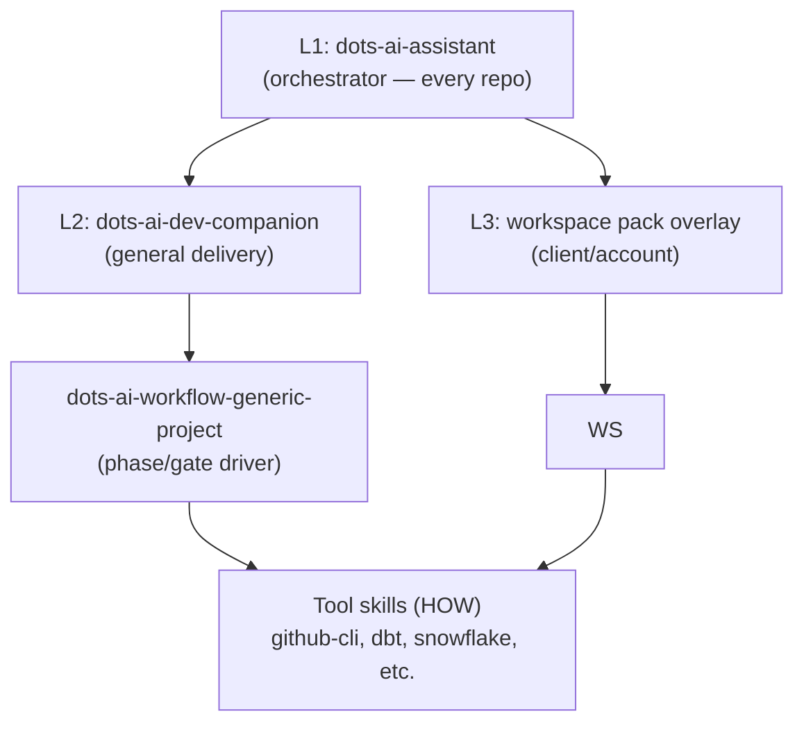

# dots-ai Dev Companion (general + workspace overlays)

This document is a **human** overview. Authoritative agent instructions live under **`~/.local/share/dots-ai/skills/`** after `chezmoi apply` (see **`dots-ai-dev-companion`**, **`skill-catalog.yaml`**, **`dots-ai-assistant/references/ORCHESTRATION.md`**). Client/account overlays can live in [`ai-workspace`](https://github.com/ulises-jeremias/ai-workspace), typically under `~/.ai-workspace/packs/` and `~/.ai-workspace/knowledge/`.

## Layers



| Layer | Bundled skill | Purpose |
| --- | --- | --- |
| L1 | **dots-ai-assistant** | Orchestrator + repo inspection order (every repo) |
| L2 | **dots-ai-dev-companion** | General dev companion framing for client work |
| L3 | **Workspace pack overlay** | Client/account context loaded from `~/.ai-workspace/packs/` |

Workflow skills (**dots-ai-workflow-generic-project**) remain the **phase/gate** driver; **HOW** (CLI) stays in tool skills.

> [!IMPORTANT]
> L2 and overlays are independent — if unclear which engagement context applies, the agent **must ask** before starting.

## Cursor rules pattern (client repos)

Use **thin** project rules that **point** to repo contracts instead of duplicating skills:

1. **Always**: `AGENTS.md` is the primary contract for that repository.
2. **Always**: follow **`dots-ai-assistant`** discovery order when doing substantive work.
3. **Default client delivery**: cite **`dots-ai-dev-companion`** + **`dots-ai-workflow-generic-project`**.
4. **Client/account overlays**: when an engagement has strict gates, load the appropriate workspace pack (stored under `~/.ai-workspace/packs/accounts/` or `packs/clients/`) before proceeding. If unclear, **ask** which pack/context to use.

Example stub for `.cursor/rules/dots-ai-dev-companion.mdc` (adjust globs):

```markdown
---
description: dots-ai companion routing for this repo
globs:
  - "**/*"
---

- Follow root `AGENTS.md` first.
- Use bundled skills under `~/.local/share/dots-ai/skills/`; orchestrate via `dots-ai-assistant` and `skill-catalog.yaml`.
- For generic client delivery: `dots-ai-dev-companion` + `dots-ai-workflow-generic-project`.
- For strict client/account work: load the workspace pack first, then use `dots-ai-dev-companion` + `dots-ai-workflow-generic-project` with the pack’s gates/constraints.
```

Keep rules **short**; put long policy in `AGENTS.md` and skills.

## Registry defaults (baseline)

`dots-ai-dev-companion` and **`dots-ai-workflow-generic-project`** ship **`enabled: true`** in `home/.chezmoidata/skills-registry.yaml` so `dots-skills sync` links them after `chezmoi apply`. To **opt out** on a machine, override chezmoi data and set `enabled: false` for the skill names you do not want symlinked.

## Optional local runner (queue)

IDE-first workflows are the default. For **optional** background processing, see:

- `~/.local/share/dots-ai/dev-companion/README.md` (installed from chezmoi `home/dot_local/share/dots-ai/dev-companion/`)

Guardrails: **`dots-ai-dev-companion/references/LOOP_GUARDRAILS.md`**. Third-party reference excerpts (MIT) live under **`~/.local/share/dots-ai/third-party/everything-claude-code/`** with **`NOTICE.md`**.

## Security and prohibited automation

> [!CAUTION]
> Never commit tokens or auto-merge to shared branches from the companion or queue worker.

- **Secrets**: only via `~/.config/dots-ai/env.d/*.env` (or project-documented patterns); never commit tokens.
- **No** auto-merge to shared default branches from the companion or queue worker unless an explicit, documented policy exists in the **target repo**.
- **Snowflake/dbt**: never claim validation success without credentials; follow **snowflake-validation** / **dbt-validation** boundaries.
- **Optional**: run `npx ecc-agentshield scan` against Claude Code / MCP configs if you use those harnesses (upstream tool; not required for the baseline).

## LLM Integration

The dev-companion runner includes a **provider-agnostic LLM layer** that works out-of-the-box with OpenCode's `big-pickle` model (free, local).

See [DEV_COMPANION_LLM.md](DEV_COMPANION_LLM.md) for:
- Provider priority and selection
- Zero-config setup
- Advanced configuration (Ollama, Claude, OpenAI)

## Related

- [CLIENT_AI_PLAYBOOKS.md](CLIENT_AI_PLAYBOOKS.md) — client workflow conventions
- [AI_LAYER.md](AI_LAYER.md) — AI directory structure and Ralph Loop
- [SKILLS.md](SKILLS.md) — full skills system
- [DEV_COMPANION_PLATFORM.md](DEV_COMPANION_PLATFORM.md) — platform schema and multi-harness design
- [DEV_COMPANION_LLM.md](DEV_COMPANION_LLM.md) — LLM provider priority and configuration
- [MULTI_AGENT_ORCHESTRATION.md](MULTI_AGENT_ORCHESTRATION.md) — multi-agent runtime
- [ECC_PATTERNS.md](ECC_PATTERNS.md) — error correction and context patterns
- [DEV_COMPANION_RELIABILITY.md](DEV_COMPANION_RELIABILITY.md) — reliability patterns
