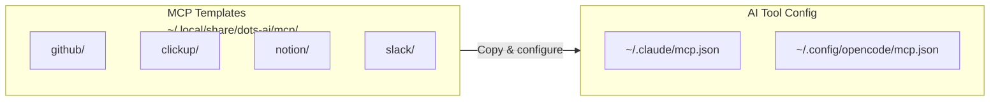

# MCP Templates

The platform ships MCP (Model Context Protocol) starter templates for integrating external services with AI tools. Templates provide a **secret-free, copy-and-configure** starting point for each provider.

## Overview



## Available providers

| Provider | Template directory | Primary use case |
|----------|--------------------|-----------------|
| **GitHub** | `mcp/github/` | Repository management, PRs, issues |
| **ClickUp** | `mcp/clickup/` | Task management, sprint tracking |
| **Notion** | `mcp/notion/` | Knowledge base, documentation |
| **Slack** | `mcp/slack/` | Team communication, notifications |

## Provider package format

Each provider directory includes:

| File | Purpose |
|------|---------|
| `README.md` | Setup instructions and usage examples |
| `config.template.json` | JSON config with `${ENV_VAR}` placeholders |
| `wrapper.sh` | Sample launcher script for MCP server startup |

> [!TIP]
> Templates use `${ENV_VAR}` placeholder syntax. Copy the template, replace placeholders with your actual environment variable names, and add to your AI tool's MCP configuration.

## Required environment variables

Each provider requires specific credentials. Store these in `~/.config/dots-ai/env.d/`:

| Provider | Env file | Required variables |
|----------|----------|--------------------|
| GitHub | `github.env` | `GITHUB_TOKEN` |
| ClickUp | `clickup.env` | `CLICKUP_API_TOKEN` |
| Notion | `notion.env` | `NOTION_API_TOKEN` |
| Slack | `slack.env` | `SLACK_BOT_TOKEN`, `SLACK_APP_TOKEN` |

> [!IMPORTANT]
> All templates are **secret-free** by default. Never commit actual tokens — use the `env.d/` mechanism or your AI tool's native secret management.

## Usage: Adding a provider to Claude Code

```bash
# 1. Copy the template
cp ~/.local/share/dots-ai/mcp/github/config.template.json /tmp/github-mcp.json

# 2. Edit with your env var references
$EDITOR /tmp/github-mcp.json

# 3. Merge into your Claude MCP config
# See: https://docs.anthropic.com/en/docs/claude-code/mcp
```

## Usage: Adding a provider to OpenCode

```bash
# 1. Copy the template
cp ~/.local/share/dots-ai/mcp/clickup/config.template.json /tmp/clickup-mcp.json

# 2. Configure and merge into ~/.config/opencode/mcp.json
$EDITOR /tmp/clickup-mcp.json
```

## Writing a new MCP template

To add a new provider template to the baseline:

1. Create `home/dot_local/share/dots-ai/mcp/<provider>/`
2. Add `README.md` with setup steps and example usage
3. Add `config.template.json` with `${ENV_VAR}` placeholders:
   ```json
   {
     "mcpServers": {
       "my-provider": {
         "command": "npx",
         "args": ["-y", "@my-provider/mcp-server"],
         "env": {
           "API_TOKEN": "${MY_PROVIDER_TOKEN}"
         }
       }
     }
   }
   ```
4. Optionally add `wrapper.sh` for custom server startup logic
5. Document the required env vars in this file

> [!NOTE]
> MCP templates are **not** skills. They configure external tool servers that AI tools connect to, while skills teach AI tools **how to behave**. Both live under `~/.local/share/dots-ai/` but serve different purposes.

---

## See Also

- [AI_LAYER.md](AI_LAYER.md) — Shared AI resources overview
- [SKILLS.md](SKILLS.md) — Skills system (distinct from MCP)
- [TECHNICAL_QUICKSTART.md](TECHNICAL_QUICKSTART.md) — Bootstrapping the workstation
- [CLI_HELPERS.md](CLI_HELPERS.md) — `dots-loadenv` for environment variable management
