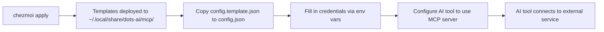

# MCP Templates

> Model Context Protocol server templates for AI tool integration.

---

The platform ships MCP starter templates for connecting AI tools to external services.

## Available templates

| Provider | Directory | Purpose |
|----------|-----------|---------|
| **GitHub** | `github/` | Repository access, issues, PRs |
| **ClickUp** | `clickup/` | Legacy reference only; use the `clickup` CLI instead |
| **Slack** | `slack/` | Channel access and messaging |
| **Notion** | `notion/` | Pages, databases, search |
| **Linear** | `linear/` | Issues, cycles, projects (OAuth, no token required) |
| **Figma** | `figma/` | Design context, screenshots, variables, assets |

Templates are installed to `~/.local/share/dots-ai/mcp/` during `chezmoi apply`.

> [!NOTE]
> Linear and Figma use the **streamable HTTP** transport (no local
> `wrapper.sh`); their `config.template.json` is meant to be copied into the
> MCP config file of your AI tool (Claude Code, Cursor, OpenCode, Windsurf).
> See each template's `README.md` for the per-tool registration matrix.

> [!TIP]
> The wiki has guided setup pages for each integration: see `docs/wiki/INTEGRATIONS.md`.

---

## Provider package format

Each provider directory includes:

| File | Purpose |
|------|---------|
| `README.md` | Setup guidance specific to the provider |
| `config.template.json` | Configuration template with env-var placeholders |
| `wrapper.sh` | Sample launcher script for the MCP server |

---

## Setup flow



---

## Required environment variables

| Provider | Variables |
|----------|-----------|
| **GitHub** | `GITHUB_TOKEN` |
| **ClickUp** | `CLICKUP_API_TOKEN` |
| **Slack** | `SLACK_BOT_TOKEN`, `SLACK_APP_TOKEN` |
| **Notion** | `NOTION_API_TOKEN` |
| **Linear** | _none_ (OAuth flow handled by your AI tool on first call) |
| **Figma** | `FIGMA_OAUTH_TOKEN`, `FIGMA_REGION` (default `us-east-1`) |

> [!CAUTION]
> All templates are **secret-free** by default. Never hardcode tokens in configuration files. Use `~/.config/dots-ai/env.d/` for persistent secrets.

---

## Example: GitHub MCP setup

```bash
# Navigate to the template
cd ~/.local/share/dots-ai/mcp/github/

# Copy template
cp config.template.json config.json

# Set your token
export GITHUB_TOKEN="ghp_your_token_here"

# Start the server
./wrapper.sh
```

---

## See Also

- [AI_LAYER.md](AI_LAYER.md) — AI directory structure overview
- [wiki/CLI.md](wiki/CLI.md) — `dots-*` command reference
- [SKILLS.md](SKILLS.md) — skills system and skill-catalog.yaml
- [wiki/INTEGRATIONS.md](wiki/INTEGRATIONS.md) — guided integration setup
