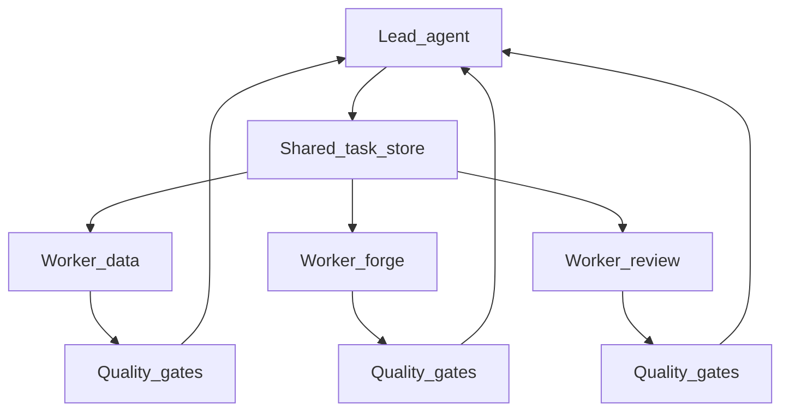

# Multi-Agent Orchestration (Optional)

dots-ai Dev Companion policies are harness-agnostic; multi-agent runtimes are **optional**.

> [!NOTE]
> Multi-agent is an advanced capability. Most delivery tasks are fully handled by the single-agent Dev Companion workflow. Only consider multi-agent when parallel work across components provides clear value.

## When to use multi-agent

- Large changes spanning multiple components (backend + dbt + infra).
- Verification-heavy tasks (multiple test suites, CI parity).
- Time-boxed delivery where parallel exploration reduces risk.

## Recommended runtime: pi.dev teams (optional)

Why: file-based task store, auto-claim, messaging, worktrees, and hook/quality-gate support.

### Suggested team topology (dots-ai)

- **Lead**: one orchestrator session that routes via `dots-ai-assistant` + packs.
- **Workers (examples)**:
  - `data-validate` (dbt + snowflake validation evidence)
  - `forge-pr` (draft PR/MR + template)
  - `reviewer` (self-review checklist + security gate)
  - `docs-sync` (update docs pointers)

Workers should have **explicit boundaries** (allowed paths) derived from account packs.

### Worktree isolation

> [!IMPORTANT]
> Each worker **must** operate in its own git worktree. Shared worktrees between workers cause merge conflicts and non-deterministic failures.

Prefer one git worktree per worker to keep edits isolated.

### Hook-based quality gates

Enable completion hooks so that "task completed" is only accepted once repo-documented checks pass.

High-level flow:



## Domain ownership enforcement

> [!CAUTION]
> Workers that attempt to operate outside their allowed paths must be **rejected and escalated** to the lead. Never silently allow cross-domain access.

Enforce boundaries using **account packs**:

- Allowed repo roots (paths)
- Required tools/env vars for privileged actions
- Default automation level (plan-only unless explicitly opted in)

If a worker attempts to operate outside allowed paths, it should be rejected and escalated to the lead.

---

## Personas as scope constraints

When orchestrating multiple agents, **personas** constrain what each agent is allowed to do:

| Persona | Constraint |
|---------|-----------|
| `implementer` | Write code, no long analysis |
| `reviewer` | Read and report, no changes |
| `researcher` | Explore only, no implementation |
| `architect` | Design and options, no code |
| `writer` | Docs only, no implementation code | *(planned — no shipped agent yet)* |

Assign personas to workers explicitly. A `reviewer` worker should never make file changes. A `researcher` worker should never commit.

Persona definitions for Claude Code-based agents ship in this repo at
`home/dot_claude/agents/` (deployed by chezmoi to `~/.claude/agents/`).
The running workspace (`dots-ai-workspace/personas/`) may carry additional
workspace-session personas. Both follow a **constraints-first** pattern:
- Define what the agent **must NOT do** first
- Then define expected output format
- Then define handoff triggers

### Example: reviewer worker

```yaml
worker:
  id: reviewer
  persona: reviewer
  allowed_paths: ["."]
  allowed_operations: [read, analyze, report]
  blocked_operations: [write, commit, push]
```

---

## Context packs in multi-agent setups

**Packs** bundle project-specific context (repos, IDs, conventions) so multiple agents share the same understanding:

```bash
./bin/workspace-context load packs/my-client.yaml
```

In a multi-agent setup, the lead agent loads the pack and propagates relevant context to workers via the shared task store.

Pack structure: `~/.local/share/dots-ai/dev-companion/packs/accounts/<client>/pack.yaml`

→ See [DEV_COMPANION_PLATFORM.md](DEV_COMPANION_PLATFORM.md) for the full pack schema and multi-harness design.
→ See [AGENTIC_HARNESS.md](AGENTIC_HARNESS.md) for the full three-layer architecture.

---

## See Also

- [DEV_COMPANION.md](DEV_COMPANION.md) — Dev companion layers and architecture
- [AGENTIC_HARNESS.md](AGENTIC_HARNESS.md) — Three-layer agentic harness framework
- [DEV_COMPANION_PLATFORM.md](DEV_COMPANION_PLATFORM.md) — Platform architecture and packs
- [DEV_COMPANION_RELIABILITY.md](DEV_COMPANION_RELIABILITY.md) — Reliability invariants for background runs
- [SKILLS.md](SKILLS.md) — Skills system documentation
