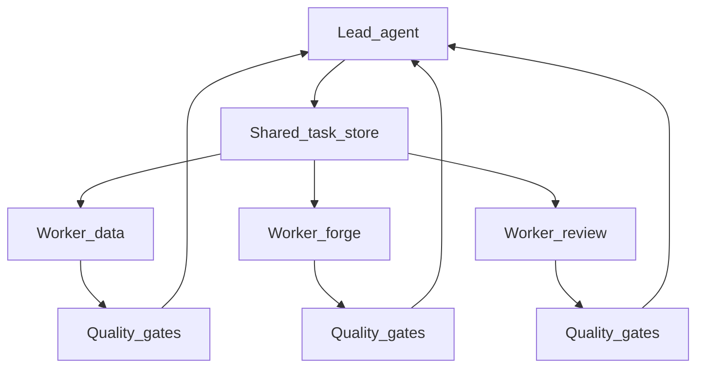

# Multi-agent orchestration (optional)

dots-ai Dev Companion policies are harness-agnostic; multi-agent runtimes are **optional**.

> [!NOTE]
> Multi-agent is an advanced option. Most developers should use the default **IDE-first interactive workflow**. Only enable multi-agent for large cross-component changes or verification-heavy tasks.

## When to use multi-agent

- Large changes spanning multiple components (backend + dbt + infra).
- Verification-heavy tasks (multiple test suites, CI parity).
- Time-boxed delivery where parallel exploration reduces risk.

## Recommended runtime: pi.dev teams (optional)

Why: file-based task store, auto-claim, messaging, worktrees, and hook/quality-gate support.

### Suggested team topology (dots-ai)

- **Lead**: one orchestrator session that routes via `dots-ai-assistant` + packs.
- **Workers (examples)**:
  - `data-validate` (dbt + snowflake validation evidence)
  - `forge-pr` (draft PR/MR + template)
  - `reviewer` (self-review checklist + security gate)
  - `docs-sync` (update docs pointers)

Workers should have **explicit boundaries** (allowed paths) derived from account packs.

### Worktree isolation

Prefer one git worktree per worker to keep edits isolated.

### Hook-based quality gates

Enable completion hooks so that “task completed” is only accepted once repo-documented checks pass.

High-level flow:

## Domain ownership enforcement

Enforce boundaries using **account packs**:

- Allowed repo roots (paths)
- Required tools/env vars for privileged actions
- Default automation level (plan-only unless explicitly opted in)

If a worker attempts to operate outside allowed paths, it should be rejected and escalated to the lead.

> [!IMPORTANT]
> Workers should never have access to paths outside their assigned account pack's `allowed_paths`. The lead agent enforces this boundary before task assignment.

---

## See Also

- [DEV_COMPANION.md](DEV_COMPANION.md) — Dev companion overview and layers
- [DEV_COMPANION_PLATFORM.md](DEV_COMPANION_PLATFORM.md) — Account packs and path allowlists
- [DEV_COMPANION_RELIABILITY.md](DEV_COMPANION_RELIABILITY.md) — Reliability invariants
- [ECC_PATTERNS.md](ECC_PATTERNS.md) — Quality gate patterns from everything-claude-code
