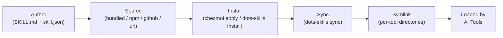
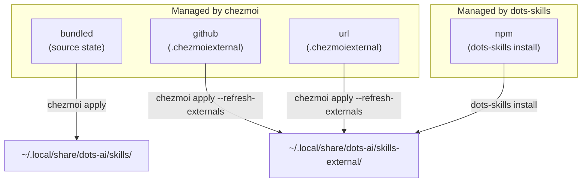

# Skills

This document describes the dots-ai skill system — how skills are defined, distributed, installed, and made available to multiple AI tools.

## Skill lifecycle overview



## What is a skill?

A **skill** is a markdown document (plus optional supporting assets) that teaches an AI tool how to perform a specific workflow. Skills are loaded by AI tools at startup and influence how they respond to user requests.

Each skill lives in its own directory and always contains:

- `SKILL.md` — the main content read by AI tools (frontmatter + instructions)
- `skill.json` — machine-readable manifest (source, version, compatibility, requirements). External skills sourced via chezmoiexternal may omit it; they are treated as universally compatible.

The bundled **dots-ai-assistant** skill is the **dots-ai Assistant** and **orchestrator**: it defines a **repository inspection order** (README → docs → `AGENTS.md` → CONTRIBUTING → PR templates → task runners → devcontainer → CI → configs → code), **conflict heuristics**, and **anti-duplication** rules. It ships `references/REPO_INSPECTION.md`, `references/ORCHESTRATION.md` (routing and delegation), and `references/AGENTS_TEMPLATE.md`; a chezmoi **project** starter lives at `home/.chezmoitemplates/agents/AGENTS.project.md.tmpl`. **`skill-catalog.yaml`** next to bundled skills lists **WHAT vs HOW**, **triggers**, and **`depends_on`** for routing. It remains useful **outside** this repository by anchoring on the **applied machine** (`~/.local/share/dots-ai/`, `dots-*`) when relevant. Future org playbooks should be **read from shipped paths**, not hardcoded in the skill body.

## Directory structure

```
~/.local/share/dots-ai/skills/           # Bundled skills (managed by chezmoi)
│   skill-catalog.yaml                   # Routing metadata (WHAT/HOW, triggers, depends_on)
│   clickup-cli/
│   │   SKILL.md
│   │   skill.json
│   slack-cli/
│   │   SKILL.md
│   │   skill.json
│   │   references/
│   github-cli-workflow/
│   gitlab-cli-workflow/
│   dbt-validation/
│   snowflake-validation/
│   workflow-generic-project/
│   dots-ai-dev-companion/
│   ui-ux-pro-max/
│   │   SKILL.md
│   │   skill.json
│   │   scripts/
│   │   data/
│   workstation-triage/
│   │   SKILL.md
│   │   skill.json
│   dots-ai-assistant/
│   │   SKILL.md
│   │   skill.json
│   │   references/
│   │       REPO_INSPECTION.md
│   │       ORCHESTRATION.md
│   │       AGENTS_TEMPLATE.md

~/.local/share/dots-ai/dev-companion/    # Optional queue + worker (see README.md)
~/.local/share/dots-ai/third-party/      # Small attributed third-party excerpts (e.g. everything-claude-code)

~/.local/share/dots-ai/skills-external/  # External skills (managed by chezmoiexternal + dots-skills)
    jira-admin/                          # ← extracted from JIRA-Assistant-Skills pack
    jira-agile/
    jira-issue/
    ...
    <npm-skill-name>/                    # ← symlinked from npm global
```

AI tools access skills through symlinks in their respective config directories:

| Tool | Skills directory |
|------|-----------------|
| Claude Code | `~/.claude/skills/` |
| GitHub Copilot CLI | `~/.copilot/skills/` |
| Cursor | `~/.cursor/skills/` |
| OpenCode | `~/.config/opencode/skills/` |
| pi agent | `~/.pi/agent/skills/` |

> [!NOTE]
> `dots-skills sync` runs automatically on every `chezmoi apply`. You only need to run it manually after installing a skill outside of chezmoi (e.g. `dots-skills install <name>`).

## Skill sources

Skills can come from four sources, using two different installation mechanisms:

| Source | Mechanism | Example |
|--------|-----------|---------|
| `bundled` | chezmoi source state | `clickup-cli`, `slack-cli` |
| `npm` | `dots-skills install` | `uipro-cli` (ui-ux-pro-max) |
| `github` | **chezmoi `.chezmoiexternal`** | `dots-ai/JIRA-Assistant-Skills` |
| `url` | **chezmoi `.chezmoiexternal`** | `https://example.com/skill.tar.gz` |



> [!TIP]
> Prefer `github` source via `.chezmoiexternal` over `dots-skills install` for GitHub-hosted skills — chezmoi handles download, extraction, caching, and refresh natively.

**`github` and `url` sources are managed natively by chezmoi** via `.chezmoiexternal.toml.tmpl`. This means:
- No custom download code — chezmoi handles HTTP, extraction, caching
- Auto-refresh with `chezmoi apply --refresh-externals`
- Declarative opt-in via `chezmoidata` flags (`install_skill_*`)

## The `skill.json` manifest

Every skill must have a `skill.json` alongside its `SKILL.md`. This is the machine-readable manifest used by `dots-skills` for installation, syncing, and compatibility checks.

### Schema

```json
{
  "$schema": "https://raw.githubusercontent.com/ulises-jeremias/dots-ai/main/lib/schemas/skill.schema.json",
  "name": "my-skill",
  "version": "1.0.0",
  "description": "Short description used by AI tools in skill selection.",
  "source": "bundled",
  "author": "dots-ai",
  "tags": ["tag1", "tag2"],
  "requires": ["some-cli-tool"],
  "compatibility": {
    "claude-code":  { "supported": true },
    "copilot-cli":  { "supported": true },
    "cursor":       { "supported": true },
    "opencode":     { "supported": true },
    "pi":           { "supported": false, "notes": "Format not supported yet" },
    "windsurf":     { "supported": true }
  }
}
```

### Fields

| Field | Required | Description |
|-------|----------|-------------|
| `name` | ✅ | Unique kebab-case identifier |
| `version` | ✅ | Semver string (e.g. `"1.0.0"`) |
| `description` | ✅ | Short description for skill selection UI |
| `source` | ✅ | `bundled`, `npm`, `github`, or `url` |
| `compatibility` | ✅ | Per-tool support declarations |
| `package` | When `source: npm` | npm package name |
| `repo` | When `source: github` | `"owner/repo"` format |
| `ref` | When `source: github` | Git ref, defaults to `"main"` |
| `url` | When `source: url` | Direct download URL |
| `author` | No | Author or org name |
| `tags` | No | Searchable tags |
| `requires` | No | CLI tools that must be installed |
| `pip_packages` | No | Python packages to install via uv/pip |

The full JSON Schema lives at [`lib/schemas/skill.schema.json`](../lib/schemas/skill.schema.json).

### Compatibility matrix

The `compatibility` object must declare support for each AI tool. Only skills with `"supported": true` for a given tool will have a symlink created in that tool's skills directory.

Known tool keys:

| Key | Tool |
|-----|------|
| `claude-code` | Anthropic Claude Code |
| `copilot-cli` | GitHub Copilot CLI |
| `cursor` | Cursor editor |
| `opencode` | OpenCode terminal agent |
| `pi` | pi coding agent |
| `windsurf` | Windsurf editor |

> **Principle**: a skill must explicitly declare support for each tool. The system never assumes "works everywhere".
> Skills without `skill.json` (e.g. from chezmoiexternal) are treated as universally compatible.

> [!IMPORTANT]
> When adding a new skill, always test compatibility with each AI tool before declaring `"supported": true`. Broken symlinks to unsupported tools cause confusing errors at tool startup.

## The Skills Registry (`skills-registry.yaml`)

`home/.chezmoidata/skills-registry.yaml` documents skills known to this baseline (same content as **`home/dot_local/share/dots-ai/skills-registry.yaml`**, which chezmoi deploys to `~/.local/share/dots-ai/skills-registry.yaml` for `dots-skills`). It is used by `dots-skills` for **bundled and npm** sources.

**`github` and `url` skills are no longer in this registry** — they are declared in `.chezmoiexternal.toml.tmpl` and installed natively by chezmoi.

```yaml
skills:
  # Bundled: installed by chezmoi source state
  - name: clickup-cli
    source: bundled
    enabled: true

  - name: workflow-generic-project
    source: bundled
    enabled: true

  # npm: installed by dots-skills install
  - name: ui-ux-pro-max
    source: npm
    package: uipro-cli
    enabled: true

  # github/url → see .chezmoiexternal.toml.tmpl
```

## External Skills via chezmoi (`.chezmoiexternal`)

`github` and `url` skills are managed by chezmoi's native external mechanism. This lives at:

```
home/private_dot_local/share/dots-ai/.chezmoiexternal.toml.tmpl
```

Chezmoi handles download, extraction, caching, and refresh — no custom bash needed.

**Opt-in**: controlled by `install_skill_*` flags in chezmoidata/toml config:
```toml
# ~/.config/chezmoi/chezmoi.toml
[data]
install_skill_jira_assistant = true
```

Or answered during `chezmoi init` interactive prompts.

**To refresh**: `chezmoi apply --refresh-externals`

### Skill Packs via chezmoiexternal

A **skill pack** is a GitHub repo with multiple skills under a subdirectory. Each pack gets its own unique key (target subdirectory) inside `skills-external/`, so multiple packs don't conflict:

```toml
# Key = target path relative to ~/.local/share/dots-ai/
# stripComponents=2 strips "RepoName-main/" and "skills/" from the archive paths
["skills-external/jira-assistant"]
    type            = "archive"
    url             = "https://github.com/ulises-jeremias/JIRA-Assistant-Skills/archive/refs/heads/main.tar.gz"
    stripComponents = 2          # "Repo-main/skills/jira-admin/SKILL.md" → "jira-admin/SKILL.md"
    include         = ["*/skills/**"]  # all files under skills/ subtree
    refreshPeriod   = "168h"
```

Result on disk:
```
skills-external/
  jira-assistant/         ← pack directory (unique key)
    jira-admin/           ← individual skill
      SKILL.md
    jira-agile/
      SKILL.md
    ...
```

`dots-skills sync` discovers 2 levels deep in `skills-external/` — it detects that `jira-assistant/` has no `SKILL.md` (it's a pack), so it scans one level deeper to find the individual skills.

`dots-ai/JIRA-Assistant-Skills` is a skill pack with 14 specialized JIRA skills:

| Skill | Purpose |
|-------|---------|
| `jira-assistant` | Meta-router — routes requests to the right JIRA skill |
| `jira-issue` | Issue CRUD (create, read, update, delete) |
| `jira-search` | JQL queries and filters |
| `jira-lifecycle` | Workflow transitions, assignments, versions |
| `jira-agile` | Sprints, epics, story points |
| `jira-collaborate` | Comments, attachments, watchers |
| `jira-relationships` | Issue linking and dependency chains |
| `jira-time` | Time logging and worklogs |
| `jira-jsm` | Service desk, SLAs, queues |
| `jira-bulk` | Bulk operations on 10–50+ issues |
| `jira-dev` | Git/PR integration with JIRA |
| `jira-fields` | Custom field discovery |
| `jira-ops` | Cache, diagnostics, project discovery |
| `jira-admin` | Project settings, permissions, automation |

**To install** (requires JIRA credentials):
```bash
# Recommended: store credentials in the opt-in global env.d mechanism:
mkdir -p ~/.config/dots-ai/env.d
$EDITOR ~/.config/dots-ai/env.d/jira.env

# Example ~/.config/dots-ai/env.d/jira.env:
# export JIRA_API_TOKEN="your-token"
# export JIRA_EMAIL="you@company.com"
# export JIRA_SITE_URL="https://company.atlassian.net"

# Enable in chezmoi config:
chezmoi edit-config   # add: install_skill_jira_assistant = true  under [data]
chezmoi apply         # downloads pack via chezmoiexternal + installs jira-as + syncs symlinks
```

**Multi-tool compatibility**: The JIRA skills use `SKILL.md` with YAML frontmatter — readable by all AI tools. The `allowed-tools` field in the frontmatter is Claude Code-specific and is safely ignored by other tools. Since there is no `skill.json`, `dots-skills sync` treats them as universally compatible and links them for all configured AI tools.

## Managing skills with `dots-skills`

`dots-skills` is the CLI helper for skill management. It works alongside chezmoi:

```
dots-skills list              List installed skills and their status per AI tool
dots-skills sync              Regenerate symlinks (reads skill.json or defaults to all tools)
dots-skills install <name>    Install an npm-sourced skill from the registry
dots-skills check             Validate required CLI tools and pip packages for each skill
dots-skills add npm:<pkg>     Add an npm skill to the registry
```

> **Note**: `github` and `url` skills are now managed by chezmoi (`.chezmoiexternal`), not by `dots-skills install`. Run `chezmoi apply` instead.

### `dots-skills list`

Shows all discovered skills with their source and symlink status per AI tool:

```
NAME                SOURCE   VERSION    claude-code    copilot-cli    cursor
clickup-cli    bundled  1.0.0      ✓ linked       ✓ linked       ✓ linked
jira-admin          external ?          ✓ linked       ✓ linked       ✓ linked
jira-agile          external ?          ✓ linked       ✓ linked       ✓ linked
ui-ux-pro-max       npm      1.0.0      ✓ linked       ✓ linked       ✓ linked
```

### `dots-skills sync`

Reads every skill directory (both `skills/` and `skills-external/`), checks the `skill.json` compatibility matrix (or assumes universal if absent), and creates/removes symlinks. Idempotent and safe to re-run.

If a skill is listed in `skills-registry.yaml` with **`enabled: false`**, it is **skipped** (no symlinks created), and any existing symlinks pointing at that skill are **removed**. Skills not listed in the registry are treated as enabled. **Workflow** and **dev companion** skills default to **`enabled: true`** in the baseline registry; use **`enabled: false`** to opt out (see [CLIENT_AI_PLAYBOOKS.md](CLIENT_AI_PLAYBOOKS.md)).

Called automatically by `run_onchange_45-install-ai-agents.sh.tmpl` on every `chezmoi apply`.

After installation, runs `dots-skills sync` automatically.

### `dots-skills check`

For each skill that is **not** disabled via `skills-registry.yaml` (`enabled: false`), checks that every tool listed in `requires` is available in `$PATH`. Reports missing tools with install suggestions.

## Adding a new skill

### Client and project bundled skills

For **client engagement** or **project-specific** AI workflows, use the naming and **workflow** rules in [CLIENT_AI_PLAYBOOKS.md](CLIENT_AI_PLAYBOOKS.md). Register new skills in `skills-registry.yaml`; set **`enabled: false`** when a skill should stay off by default for most engineers.

### Bundled skill (in this repo)

1. Create `home/dot_local/share/dots-ai/skills/<name>/` (chezmoi source path under `home/`)
2. Add `SKILL.md` with YAML frontmatter and content
3. Add `skill.json` with the manifest
4. Add an entry to `home/.chezmoidata/skills-registry.yaml`
5. Run `chezmoi apply` — `dots-skills sync` will create the symlinks automatically

### External skill (from npm)

1. Find the npm package that exposes a `SKILL.md` (e.g. `uipro-cli`)
2. Add an entry to `skills-registry.yaml`:
   ```yaml
   - name: my-skill
     source: npm
     package: my-skill-npm-pkg
     enabled: true
   ```
3. Run `dots-skills install my-skill` or `chezmoi apply`

### External skill (from GitHub)

1. Create a repo with `SKILL.md` + `skill.json` at the root
2. Add an entry to `skills-registry.yaml`:
   ```yaml
   - name: my-skill
     source: github
     repo: myorg/my-skill
     ref: v1.0.0
     enabled: true
   ```
3. Run `dots-skills install my-skill`

## Multi-tool compatibility guidelines

When writing a skill, always declare compatibility explicitly. If you are unsure whether a tool supports the skill format, set `"supported": false` with a note.

**Do** declare support only after testing:
```json
"cursor": { "supported": true }
```

**Do** add notes when support is partial or has caveats:
```json
"pi": { "supported": false, "notes": "pi does not load external skill files yet" }
```

**Don't** assume "works everywhere" — the point of the compatibility matrix is to make this explicit and opt-in per tool.

> [!WARNING]
> Do not set `"supported": true` without testing the skill in the target AI tool. Partial support (e.g. frontmatter fields ignored by some tools) should use `"supported": true` with a `"notes"` field documenting caveats.

## Publishing a skill to npm

If you want to share a skill publicly via npm:

1. Create a package with `SKILL.md` and `skill.json` at the root
2. The `skill.json` `source` should still reflect the intended distribution method (`npm`)
3. Publish normally: `npm publish`
4. Other users can add it to their `skills-registry.yaml` as an `npm` source skill

Example minimal `package.json` for a skill package:

```json
{
  "name": "my-awesome-skill",
  "version": "1.0.0",
  "description": "My awesome AI skill",
  "files": ["SKILL.md", "skill.json", "scripts/", "data/"]
}
```

---

## See Also

- [ARCHITECTURE.md](ARCHITECTURE.md) — High-level architecture and layered model
- [AI_LAYER.md](AI_LAYER.md) — Shared AI resources and directory structure
- [CLI_HELPERS.md](CLI_HELPERS.md) — `dots-skills` command reference
- [CLIENT_AI_PLAYBOOKS.md](CLIENT_AI_PLAYBOOKS.md) — Client/project skill naming and workflow rules
- [DEV_COMPANION.md](DEV_COMPANION.md) — Dev companion layers and automation
- [MCP_TEMPLATES.md](MCP_TEMPLATES.md) — MCP provider starter templates
