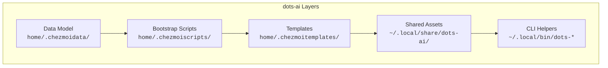

# Architecture

Design principles and layered model. For full details, see [docs/ARCHITECTURE.md](https://github.com/ulises-jeremias/dots-ai/blob/main/docs/ARCHITECTURE.md).

## Design principles

- Keep the source state simple and predictable
- Prefer profile-driven behavior over host-specific custom logic
- Keep scripts idempotent and safe to re-run
- Treat docs, wiki, and ADRs as first-class product artifacts

## Layered model

| Layer | Path | Purpose |
|-------|------|---------|
| **Data model** | `home/.chezmoidata/` | Profiles, packages, AI flags, skills registry |
| **Bootstrap** | `home/.chezmoiscripts/` | Idempotent setup scripts (incl. `dots-skills sync`) |
| **Templates** | `home/.chezmoitemplates/` | Reusable AI instruction templates |
| **Shared assets** | `home/dot_local/share/dots-ai/` | Skills, MCP, dev-companion, prompts |
| **CLI helpers** | `home/dot_local/bin/` | `dots-*` commands |

## Skills architecture

Two-layer model:

- **Bundled skills** — defined in this repo, distributed via chezmoi
- **External skills** — installed from npm, GitHub, or URLs by `dots-skills install`

Each skill's `skill.json` manifest declares AI tool compatibility. `dots-skills sync` reads manifests and creates symlinks.

## Source state convention

- `.chezmoiroot` points to `home/`
- Repository root = docs, CI, project metadata, schemas
- `lib/schemas/` contains JSON Schema definitions

## See also

- [ADRs](ADRS) — architecture decision records
- [AI Overview](AI) — the AI layer in detail
- [Skills System](SKILLS) — skill manifests and registry
