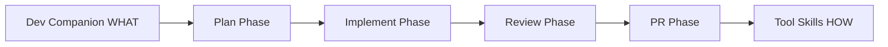

# Dev Companion

The dev companion provides AI-powered delivery workflow assistance. For full details, see [docs/DEV_COMPANION.md](https://github.com/ulises-jeremias/dots-ai/blob/main/docs/DEV_COMPANION.md).

## Layers

| Layer | Skill | Purpose |
|-------|-------|---------|
| L1 | `dev-assistant` | Orchestrator + repo inspection (every repo) |
| L2 | `dev-companion` | General dev companion framing for client work |

Workflow skills (`workflow-generic-project`) drive **phases and gates**; tool skills own CLI procedures.

## How it works

The dev companion follows a **WHAT/HOW** pattern:

- **WHAT** skills define delivery phases: plan → implement → review → PR
- **HOW** skills handle tool-specific CLIs (GitHub, GitLab, dbt, etc.)



## Optional background runner

For autonomous processing, the dev companion includes a queue/worker system:

```bash
dots-devcompanion enqueue <id>    # queue a job
dots-devcompanion run-once        # process next job
dots-devcompanion status          # check queue
dots-devcompanion done <id>       # mark complete
```

> [!NOTE]
> IDE-first workflows are the default. The background runner is optional.

## LLM integration

The runner includes a **provider-agnostic LLM layer** supporting multiple backends:

| Provider | Type | Config required |
|----------|------|----------------|
| OpenCode (`big-pickle`) | Free, local | None (zero-config) |
| Ollama | Local GPU | `OLLAMA_HOST` |
| Claude | Cloud | `ANTHROPIC_API_KEY` |
| OpenAI | Cloud | `OPENAI_API_KEY` |

See [LLM Providers](LLM_PROVIDERS) for full configuration.

## See also

- [AI Overview](AI) — the broader AI layer
- [LLM Providers](LLM_PROVIDERS) — provider priority and setup
- [Skills System](SKILLS) — how skills are managed
